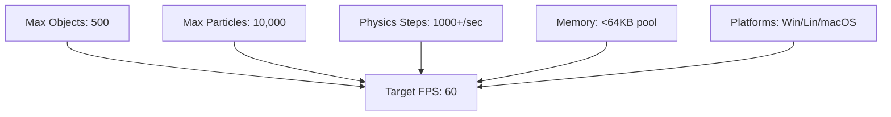
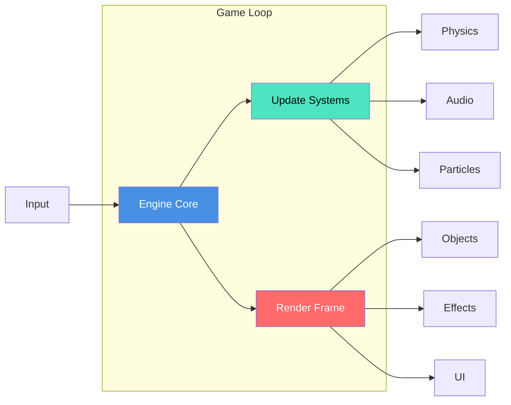
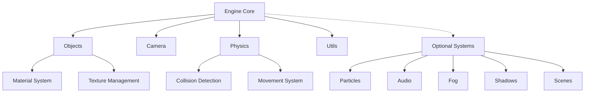

# 🎮 QWEE Engine v0.3

<div align="center">


  
**Lightweight 3D Game Engine for Rapid Prototyping & Learning**

[](https://opensource.org/licenses/MIT)
[](https://github.com/qwee-engine/qwee)
[](https://github.com/qwee-engine/qwee/releases)
[](https://www.raylib.com/)

*A minimalistic 3D game engine that fits in your head*

</div>

## 📋 Table of Contents
- [✨ Features](#-features)
- [🚀 Quick Start](#-quick-start)
- [🏗️ Architecture](#️-architecture)
- [📦 Installation](#-installation)
- [🎮 Examples](#-examples)
- [📚 API Documentation](#-api-documentation)
- [🛠️ Building from Source](#️-building-from-source)
- [🤝 Contributing](#-contributing)
- [📄 License](#-license)
- [🙏 Acknowledgments](#-acknowledgments)

## ✨ Features

### 🎯 **Core Engine**
| Feature | Status | Description |
|---------|--------|-------------|
| **Object System** | ✅ Complete | Cubes, spheres, cylinders, pyramids, planes |
| **Physics** | ✅ Complete | AABB/Sphere collisions, gravity, movement |
| **Camera** | ✅ Complete | First-person controls with mouse look |
| **Particles** | ✅ Complete | Fire, smoke, rain, snow, sparks, dust |
| **Fog System** | ✅ Complete | Linear, exponential, volumetric fog |
| **Shadows** | ✅ Complete | Simple, soft, and dramatic shadows |
| **Audio** | ✅ Complete | Sound effects, music, 3D positional audio |
| **Scene System** | ✅ Complete | 2D/3D scene management with switching |

### 📊 **Performance & Limits**


### 🎨 **Technical Highlights**
- **Minimal Codebase**: ~10,000 lines of readable C code
- **Zero Dependencies**: Only requires Raylib
- **Fast Compilation**: Builds in seconds, not minutes
- **Educational**: Code is designed to be understood
- **Scriptable**: Built-in script interpreter for rapid prototyping

## 🚀 Quick Start

### 1. **Install Dependencies**
```bash
# Windows
./install.bat

# Linux
make install_deps

# macOS
brew install raylib
```

### 2. **Build Everything**
```bash
make all
```

### 3. **Run Example Games**
```bash
# Arena Shooter (3D FPS)
make run_arena

# Empty Template (Start your game here)
make run_empty

# Platformer (3D platformer example)
make run_platformer
```

### 4. **Create Your First Game**
```c
// minimal.c
#include "engine.h"

int main(void) {
    InitEngine(1280, 720, "My Game", false);
    
    // Create a player
    CreatePlayer("Hero", 0, 1, 0, true, true);
    
    // Create a ground plane
    CreatePlane("Ground", 0, 0, 0, 100, 100, GREEN);
    
    // Create some objects
    CreateCube("Box1", 5, 1, 5, true, true, NULL, BLUE);
    CreateSphere("Ball", -5, 2, -5, true, true, RED, 1.0f);
    
    // Main game loop
    while (!WindowShouldClose()) {
        UpdateEngine(GetDeltaTime());
        RenderAll();
    }
    
    CloseEngine();
    return 0;
}
```

Compile with:
```bash
gcc minimal.c engine.c objects.c physics.c camera.c utils.c vector_math.c \
    particles.c fog.c shadows.c audio.c scene.c -lraylib -o mygame
```

## 🏗️ Architecture

### 📁 **Project Structure**
```
qwengine/
├── core/               # Core engine systems
│   ├── engine.c/h     # Main engine coordinator
│   ├── objects.c/h    # GameObject management
│   ├── physics.c/h    # Physics & collisions
│   ├── camera.c/h     # First-person camera
│   ├── utils.c/h      # Utility functions
│   └── vector_math.c/h # Vector operations
├── systems/           # Optional systems
│   ├── particles.c/h  # Particle effects
│   ├── fog.c/h        # Atmospheric fog
│   ├── shadows.c/h    # Shadow rendering
│   ├── audio.c/h      # Sound system
│   └── scene.c/h      # Scene management
├── examples/          # Example games
│   ├── arena_shooter/ # 3D FPS example
│   ├── platformer/    # 3D platformer
│   └── empty_template/# Starter template
├── scripts/           # Script interpreter
│   └── script_interpreter.py
├── lib/               # Compiled libraries
├── include/           # Header files
├── Makefile           # Build system
├── install.bat        # Windows installer
└── README.md          # This file
```

### 🔄 **Data Flow**


### 🧩 **Module Relationships**


## 📦 Installation

### **Windows**
```powershell
# Method 1: Automated installer
.\install.bat

# Method 2: Manual setup
git clone https://github.com/yourusername/qwee-engine.git
cd qwee-engine
make install_deps
make all
```

### **Linux**
```bash
# Ubuntu/Debian
sudo apt-get update
sudo apt-get install gcc make libraylib-dev libasound2-dev \
    libx11-dev libxrandr-dev libxi-dev libgl1-mesa-dev

# Build the engine
make all
```

### **macOS**
```bash
# Install Homebrew if needed
/bin/bash -c "$(curl -fsSL https://raw.githubusercontent.com/Homebrew/install/HEAD/install.sh)"

# Install dependencies
brew install raylib

# Build the engine
make all
```

### **Verify Installation**
```bash
# Check if everything works
make test

# Expected output:
# ✓ Engine library built
# ✓ Arena Shooter built
# ✓ Empty template built
# ✓ Platformer built
```

## 🎮 Examples

### **1. Arena Shooter**
A complete 3D first-person shooter with waves of enemies, power-ups, and particle effects.

```bash
make arena_shooter
make run_arena
```

**Features:**
- Wave-based enemy spawning
- Health & ammo systems
- Power-ups (speed, damage, health)
- Particle effects for combat
- Dynamic UI with semi-transparent panels
- Automatic ammo spawning every 30 seconds

### **2. Empty Template**
A minimal starting point for your own games.

```bash
make empty_template
make run_empty
```

### **3. Platformer**
A 3D platformer example with jumping, collectibles, and obstacles.

```bash
make platformer
make run_platformer
```

### **4. Script-based Game**
Create games using the QWEE script language:

```python
# game.qwee
window {
    width 1280
    height 720
}

scene3d(main) {
    create.obj.player(0, 1, 0, true, true)
    create.obj.plane("Ground", 0, 0, 0, 100, 100, GREEN)
    create.obj.box("Enemy", 10, 1, 10, true, true, NULL, RED)
}
```

Convert and run:
```bash
make script
make build_script
make run_script_game
```

## 📚 API Documentation

### **Core Functions**

#### Engine Management
```c
// Initialize/close engine
void InitEngine(int width, int height, const char* title, bool fullscreen);
void CloseEngine();

// Main loop functions
void UpdateEngine(float deltaTime);
void RenderAll();

// System toggles
void ToggleParticles(bool enabled);
void ToggleFog(bool enabled);
void ToggleShadows(bool enabled);
void ToggleAudio(bool enabled);
```

#### Object Creation
```c
// Basic shapes
GameObject* CreateCube(const char* name, float x, float y, float z, 
                      bool physics, bool collision, 
                      const char* texture, Color color);

GameObject* CreateSphere(const char* name, float x, float y, float z,
                        bool physics, bool collision,
                        Color color, float radius);

GameObject* CreatePlayer(const char* name, float x, float y, float z,
                        bool physics, bool collision);

// Special objects
GameObject* CreatePlane(const char* name, float x, float y, float z,
                       float width, float depth, Color color);
```

#### Physics System
```c
// Configure physics
void SetGravity(float gravity);
void SetPlayerPhysicsSettings(float walkSpeed, float runSpeed, 
                             float jumpForce, float gravity,
                             float playerHeight, float playerRadius);

// Apply forces
void ApplyForce(GameObject* obj, Vector3 force);

// Collision detection
bool CheckCollision(GameObject* a, GameObject* b);
```

#### Particle System
```c
// Create emitters
ParticleEmitter* CreateFireEmitter(Vector3 position, float intensity);
ParticleEmitter* CreateSparkEmitter(Vector3 position, int count);
ParticleEmitter* CreateRainEmitter(Vector3 areaCenter, Vector3 areaSize);
ParticleEmitter* CreateSnowEmitter(Vector3 areaCenter, Vector3 areaSize);

// Control particles
void EmitParticles(ParticleEmitter* emitter, int count);
void ClearAllParticles();
```

#### Audio System
```c
// Load and play audio
AudioFile* LoadAudio(const char* name, const char* path, 
                    AudioType type, bool loop);
void PlayAudio(AudioFile* audio, float volume);
void PlaySoundAtPosition(const char* name, Vector3 position, 
                        float maxDistance);
```

### **Complete API Reference**

| Module | Key Functions | Description |
|--------|---------------|-------------|
| **Engine** | `InitEngine`, `CloseEngine`, `UpdateEngine`, `RenderAll` | Core engine lifecycle |
| **Objects** | `CreateCube`, `CreateSphere`, `CreatePlayer`, `DestroyObject` | GameObject management |
| **Physics** | `SetGravity`, `CheckCollision`, `ApplyForce`, `UpdatePhysics` | Physics and collisions |
| **Camera** | `UpdateCameraControl`, `GetMovementVector` | First-person camera |
| **Particles** | `CreateFireEmitter`, `CreateSparkEmitter`, `UpdateParticles` | Visual effects |
| **Audio** | `LoadAudio`, `PlayAudio`, `PlaySoundAtPosition` | Sound system |
| **Utils** | `GetDeltaTime`, `RandomFloat`, `Vector3Lerp` | Utility functions |

## 🛠️ Building from Source

### **Using Makefile**
```bash
# Build everything (release mode)
make all

# Build with debug symbols
make debug

# Build only the engine library
make engine

# Clean build artifacts
make clean

# Create distribution package
make dist
```

### **Manual Compilation**
```bash
# Compile all source files
gcc -c engine.c objects.c physics.c camera.c utils.c vector_math.c \
    particles.c fog.c shadows.c audio.c scene.c billboard.c \
    -I. -O2 -Wall -std=c99

# Link into executable
gcc *.o -lraylib -lm -o qwee_game
```

### **Cross-compilation**
```bash
# Windows from Linux (MinGW)
x86_64-w64-mingw32-gcc engine.c ... -lraylib -o game.exe

# Linux from Windows (WSL)
gcc engine.c ... -lraylib -o game
```

## 🤝 Contributing

We welcome contributions! Here's how you can help:

### **Ways to Contribute**
1. 🐛 **Report Bugs** - Use the issue tracker
2. 💡 **Suggest Features** - Share your ideas
3. 📝 **Improve Documentation** - Fix typos, add examples
4. 🔧 **Submit Pull Requests** - Add features, fix bugs
5. 🎮 **Create Examples** - Build demo games

### **Development Setup**
```bash
# 1. Fork and clone the repository
git clone https://github.com/your-username/qwee-engine.git
cd qwee-engine

# 2. Install dependencies
make install_deps

# 3. Build in debug mode
make debug

# 4. Run tests
make test
```

### **Coding Standards**
- Use `snake_case` for variables and functions
- Prefix engine functions appropriately (e.g., `Create` for object creation)
- Comment complex logic with `//` comments
- Keep functions focused and under 50 lines when possible
- Use `const` for parameters that shouldn't be modified

### **Pull Request Process**
1. Create a feature branch: `git checkout -b feature-name`
2. Make your changes with tests if applicable
3. Run existing tests: `make test`
4. Update documentation if needed
5. Submit a pull request with description

## 📄 License

```
MIT License

Copyright (c) 2026 QWEE Development Team

Permission is hereby granted, free of charge, to any person obtaining a copy
of this software and associated documentation files (the "Software"), to deal
in the Software without restriction, including without limitation the rights
to use, copy, modify, merge, publish, distribute, sublicense, and/or sell
copies of the Software, and to permit persons to whom the Software is
furnished to do so, subject to the following conditions:

The above copyright notice and this permission notice shall be included in all
copies or substantial portions of the Software.

THE SOFTWARE IS PROVIDED "AS IS", WITHOUT WARRANTY OF ANY KIND, EXPRESS OR
IMPLIED, INCLUDING BUT NOT LIMITED TO THE WARRANTIES OF MERCHANTABILITY,
FITNESS FOR A PARTICULAR PURPOSE AND NONINFRINGEMENT. IN NO EVENT SHALL THE
AUTHORS OR COPYRIGHT HOLDERS BE LIABLE FOR ANY CLAIM, DAMAGES OR OTHER
LIABILITY, WHETHER IN AN ACTION OF CONTRACT, TORT OR OTHERWISE, ARISING FROM,
OUT OF OR IN CONNECTION WITH THE SOFTWARE OR THE USE OR OTHER DEALINGS IN THE
SOFTWARE.
```

## 🙏 Acknowledgments

### **Built With**
- **[Raylib](https://www.raylib.com/)** - Simple and easy-to-use library for videogames programming
- **OpenGL** - Cross-platform graphics API
- **C Programming Language** - For performance and portability

### **Inspiration**
- **PICO-8** - For showing that limitations can inspire creativity
- **Unity (early versions)** - For democratizing game development
- **DOOM Engine** - For proving simple engines can create amazing games

### **Special Thanks**
- The Raylib community for creating an amazing library
- All contributors who have helped improve QWEE Engine
- Early testers and users for their valuable feedback

---

<div align="center">

**QWEE Engine** - *Because sometimes you just want to make a game*

[📖 Documentation](https://github.com/qwee-engine/docs) | 
[🐛 Issues](https://github.com/qwee-engine/qwee/issues) | 
[💬 Discussions](https://github.com/qwee-engine/qwee/discussions) | 
[⭐ Star on GitHub](https://github.com/qwee-engine/qwee)

*Made with ❤️ for game developers everywhere*

</div>

## 📊 Project Status

| Component | Status | Notes |
|-----------|--------|-------|
| Core Engine | ✅ Stable | Production ready |
| Examples | ✅ Complete | Multiple game types |
| Documentation | ✅ Comprehensive | API reference included |
| Build System | ✅ Robust | Cross-platform support |
| Scripting | 🔧 Experimental | Basic interpreter available |

### 🔮 Roadmap to v1.0
- [ ] **v0.4** - Networking support
- [ ] **v0.5** - Save system & serialization  
- [ ] **v0.6** - Advanced rendering effects
- [ ] **v0.7** - Animation system
- [ ] **v0.8** - GUI framework
- [ ] **v0.9** - Visual editor prototype
- [ ] **v1.0** - Stable release

---

*Last Updated: January 2026*  
*QWEE Engine v0.3 - "The Understandable Engine"*
